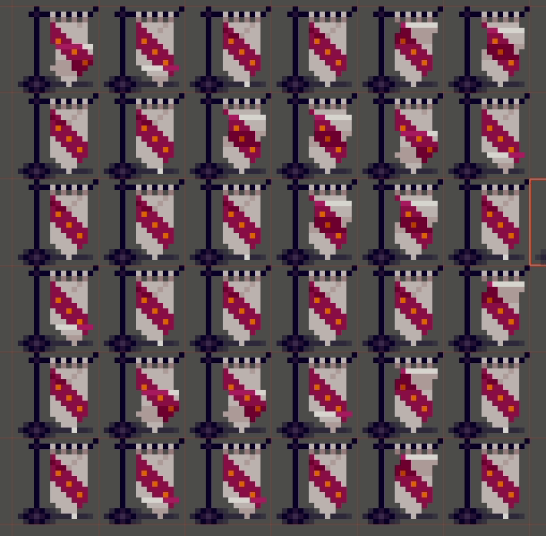

# Shader Description

uniform

- frames: eg. 6
- frameLength: eg. 0.25 (4 fps)
- frameWidth: eg. 0.034482759 (1 / 29)
- frameStart: eg. 0.655172421 (0.034482759 * 19)

fragment

- calculate currentFrame
  - calculate animationLength by multiplying frames by frameLength
  - mod time by animationLength and divide by frameLength and floor to get currentFrame
- calculate offsetFrame
  - divide uv x by frameWidth and floor to get offsetFrame
- wonky calculate offsetFrame
  - subtract frameStart from uv and divide by frameWidth and ceil to get offsetFrame
- calculate actualFrame
  - add current frame and offset frame and mod by frames to get actualFrame
- offset uv to actualFrame
  - uv = uv + ((actualFrame - offsetFrame) * frameWidth)
